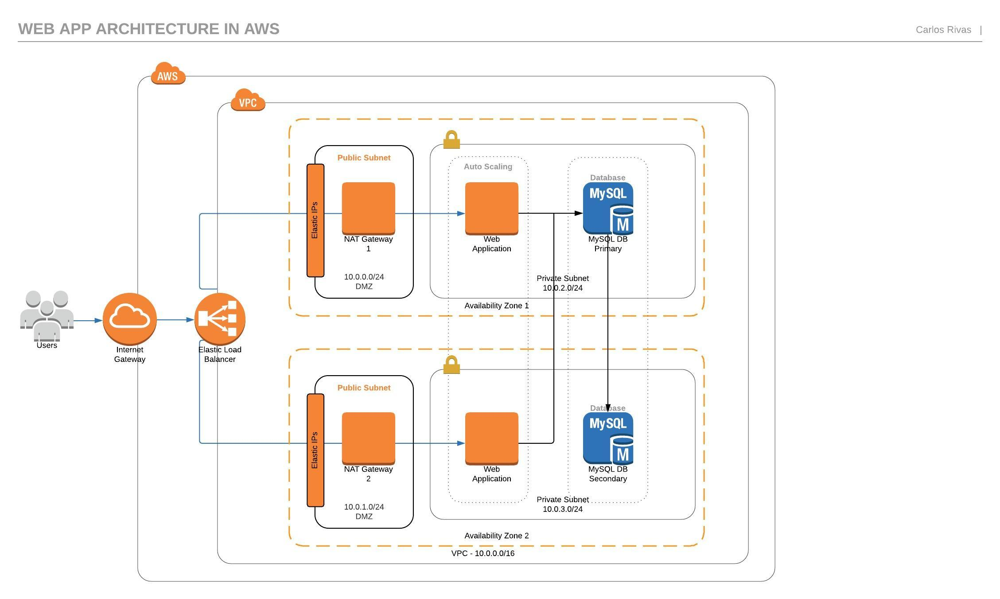
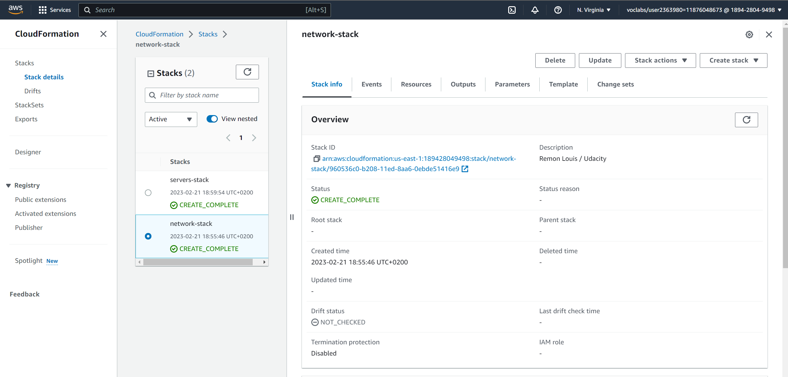
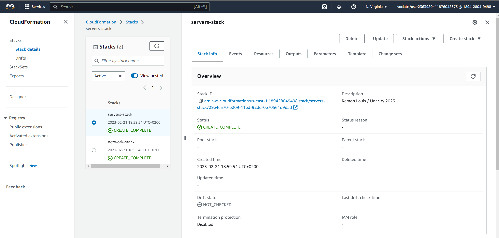
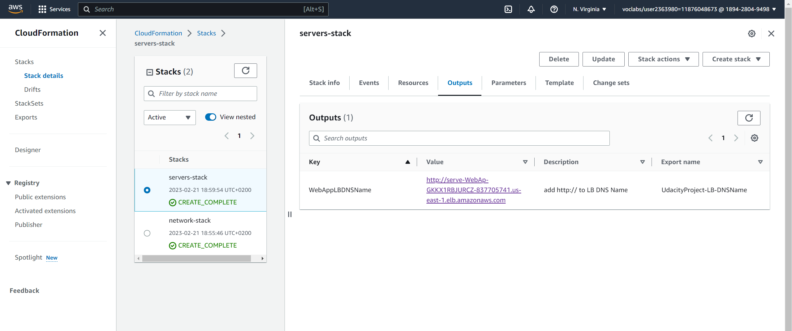
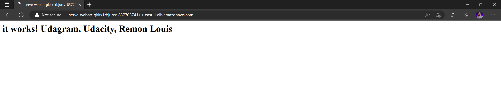

# Udacity-DevOps-SecondProject



-   To build your network run this command 
    ```bash
    ./create.sh network-stack network.yml network-parameters.json
    ```

-   To create your servers run this command 
    ```bash
    ./create.sh  servers-stack servers.yml server-parameters.json
    ```

## Sample OutPut






